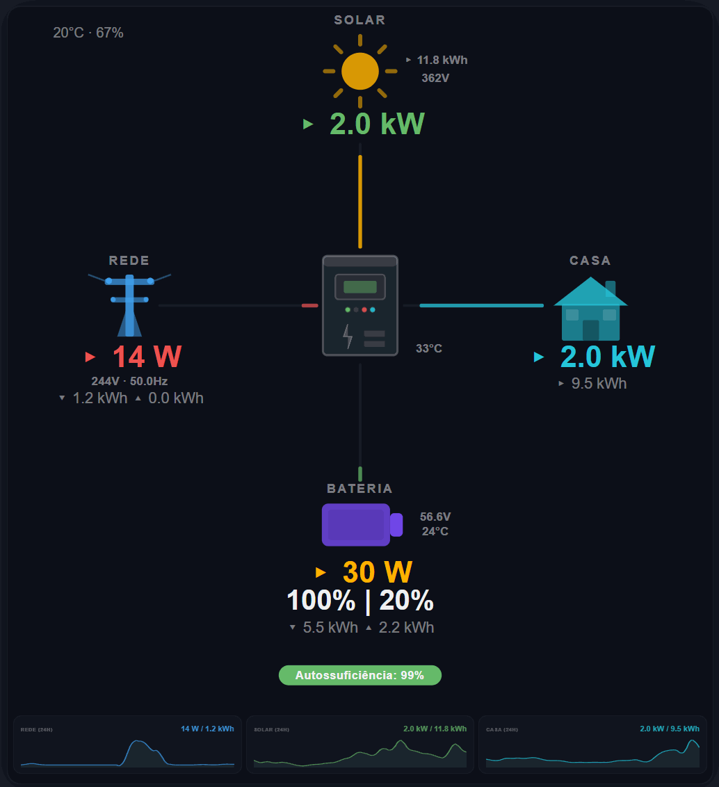

# xPower Flow Card ⚡

A modern, lightweight power flow card for **solar hybrid inverters** in Home Assistant.

Animated pulse flows, smooth 24h sparkline charts with tooltips, battery runtime estimation, dynamic inverter LEDs, and a dark glassmorphism aesthetic, all in a single file with zero dependencies.



## Supported Inverters

| Brand | Integration | Status |
|-------|-------------|--------|
| **Deye** | Solarman / deye_inverter | Tested |
| **Sunsynk** | Sunsynk / modbus | Preset |
| **Huawei** | FusionSolar | Preset |
| **Fronius** | Gen24 / Modbus | Preset |
| **Growatt** | Growatt / modbus | Preset |
| **Victron** | Venus OS / GX | Preset |
| **SolarEdge** | Modbus / SunSpec | Preset |
| **Any other** | Custom | Custom preset |

Select your brand in the visual editor — entities and polarity are auto-configured.

## Features

- **8 inverter presets: Deye, Sunsynk, Huawei, Fronius, Growatt, Victron, SolarEdge, and Custom 
- **Supports 8 languages: Portuguese, English, German, French, Spanish, Italian, Dutch, and Polish  
- **Polarity normalization** — configurable battery and grid sign conventions
- **Pulse flow animation** — continuous snake-style energy flow, speed proportional to power
- **Color-coded values** — Solar (green), Grid (red), Home (cyan), Battery (yellow)
- **Dynamic inverter LEDs** — 4 LEDs blink based on active flows (solar/battery/grid/home)
- **Realistic inverter icon** — device with display, LEDs, and status bars
- **Battery runtime** — estimated time to shutdown SOC with ETA clock
- **Battery gauge** — visual SOC level inside the battery icon
- **Weather display** — optional temperature and humidity in top-left corner
- **24h sparkline charts** — smooth Catmull-Rom area charts with auto-refresh every 5 minutes
- **Sparkline tooltips** — hover to see power value and time (e.g. `330 W · 14:30`)
- **Auto-scaling sparklines** — dynamic Y-axis based on actual data
- **Autarky pill** — color changes based on self-sufficiency (green/orange/red)
- **Daily totals** — import/export with kWh values
- **Trend arrows** — ▴ rising, ▾ falling, ▸ stable
- **Unavailable handling** — shows `--` when sensors are offline
- **Visual editor** — preset selector, polarity config, all entity fields
- **Inverter name optional** — leave empty to hide
- **Lightweight** — single file, no build step, no dependencies

## Installation

### HACS (Recommended)

1. Open HACS → Frontend → **⋮** → Custom repositories
2. Add `https://github.com/BTNBx/xPower-Flow-Card` as **Dashboard**
3. Search for "xPower Flow Card" and install
4. Refresh your browser (Ctrl+Shift+R)

### Manual

1. Download `xpower-flow-card.js` from the [latest release](https://github.com/BTNBx/xPower-Flow-Card/releases)
2. Copy to `/config/www/xpower-flow-card.js`
3. Add resource in **Settings → Dashboards → ⋮ → Resources**:
   - URL: `/local/xpower-flow-card.js`
   - Type: JavaScript Module
4. Refresh your browser

## Configuration

### Visual Editor

Add the card via the UI and use the built-in visual editor. Select your inverter brand from the **Preset** dropdown — all entities and polarity settings are auto-filled.

### YAML (Deye example)

```yaml
type: custom:xpower-flow-card
preset: deye
language: pt
inverter_name: DEYE 6K
shutdown_soc: 20
battery_capacity: 5120
weather_temp: sensor.outdoor_temperature
weather_humidity: sensor.outdoor_humidity
```

### YAML (Huawei example)

```yaml
type: custom:xpower-flow-card
preset: huawei
language: de
inverter_name: Huawei SUN2000
shutdown_soc: 10
battery_capacity: 10000
```

### YAML (Custom / any inverter)

```yaml
type: custom:xpower-flow-card
preset: custom
language: en
inverter_name: My Inverter
bat_polarity: negative
grid_polarity: positive
shutdown_soc: 15
battery_capacity: 10240
solar: sensor.my_pv_power
battery: sensor.my_battery_power
soc: sensor.my_battery_soc
grid: sensor.my_grid_power
load: sensor.my_load_power
grid_voltage: sensor.my_grid_voltage
battery_voltage: sensor.my_battery_voltage
pv_voltage: sensor.my_pv_voltage
temperature: sensor.my_inverter_temp
frequency: sensor.my_grid_frequency
grid_status: binary_sensor.my_grid_connected
daily_solar: sensor.my_daily_production
daily_import: sensor.my_daily_import
daily_export: sensor.my_daily_export
daily_load: sensor.my_daily_consumption
daily_charge: sensor.my_daily_charge
daily_discharge: sensor.my_daily_discharge
battery_temperature: sensor.my_battery_temp
weather_temp: sensor.my_outdoor_temp
weather_humidity: sensor.my_outdoor_humidity
```

### Options

| Option | Default | Description |
|--------|---------|-------------|
| `preset` | `deye` | Inverter brand preset |
| `language` | `pt` | Card language (`pt`, `en`, `de`, `fr`, `es`, `it`, `nl`, `pl`) |
| `inverter_name` | `DEYE` | Display name (leave empty to hide) |
| `bat_polarity` | `negative` | `negative` = charging (Deye) or `positive` = charging (Huawei) |
| `grid_polarity` | `positive` | `positive` = import (Deye) or `negative` = import (SolarEdge) |
| `shutdown_soc` | `20` | Battery shutdown SOC percentage |
| `battery_capacity` | `5120` | Battery capacity in Wh |
| `weather_temp` | | Optional temperature sensor for top-left display |
| `weather_humidity` | | Optional humidity sensor for top-left display |

### Polarity Guide

**Battery power:**
- `negative` = charging: Deye, Sunsynk, Growatt, Victron
- `positive` = charging: Huawei, Fronius, SolarEdge

**Grid power:**
- `positive` = importing: Deye, Sunsynk, Huawei, Fronius, Growatt, Victron
- `negative` = importing: SolarEdge

### Inverter LEDs

The 4 LEDs on the inverter icon indicate active power flows:

| LED | Color | Meaning |
|-----|-------|---------|
| 1st | 🟢 Green | Solar producing (>10W) |
| 2nd | 🟠 Orange | Battery discharging (>10W) |
| 3rd | 🔴 Red | Grid importing (>10W) |
| 4th | 🔵 Cyan | Home consuming (>10W) |

LEDs blink when active, dim gray when inactive.

## Changelog

### v1.1.3

- Grid tower icon changed to dark red
- Solar voltage aligned with kWh numbers (arrow removed)
- Inverter temperature repositioned with small gap
- Weather: humidity closer, divider line between temp and humidity
- Light theme support — auto-detects HA theme or manual dark/light/auto option
- Animation stutter fix — flow speed cached with 10% threshold
- Adaptive history sampling for large datasets (>10k points)

### v1.1.2

- Animation stutter fix — flow speed only updates on >10% change, prevents CSS restart
- Adaptive history sampling — pre-samples >10k points for better performance on low-power devices

 ### v1.1.1

- Minor update

### v1.1.0

- Zero-value sensors now display correctly (0°C, 0V no longer hidden)
- XSS protection in editor via input sanitization
- History request deduplication guard
- URL-encoded history API parameters
- Removed dead grid status code
- Snake flow refined — head reaches end before tail follows, slower animation (1.5s–3.5s)
- Solar side values aligned with arrows (▸ 13.0 kWh / ▸ 363V)
- Inverter temperature repositioned closer to icon
- Weather display with thermometer and droplet icons
- 8 languages: PT, EN, DE, FR, ES, IT, NL, PL
- GPL-3.0 license
- Reduced bottom spacing below autarky pill

### v1.0.9

- Flow animation changed from dots to pulse/snake style
- Middle section repositioned for balanced flow lines
- Grid/Home icons aligned with values
- Battery spacing from icon matched to other entities
- Inverter icon redesigned with dynamic LEDs (green=solar, orange=battery, red=grid, cyan=home)
- Inverter name optional — empty field shows nothing
- Inverter temperature positioned next to icon
- Solar side values aligned by numbers with arrow
- Solar value green, Battery value yellow, SOC white
- Weather display in top-left — configurable temperature and humidity sensors
- 8 languages: PT, EN, DE, FR, ES, IT, NL, PL
- Reduced bottom spacing below autarky pill
- Snake flow refined — head reaches end before tail follows, slower animation (1.5s–3.5s)
- Solar side values (kWh, voltage) moved further from icon and aligned

### v1.0.8

- Flow lines aligned with inverter icon edges
- Battery SOC and runtime text changed to white
- Reduced bottom spacing below autarky pill

### v1.0.7

- Flow lines realigned with inverter icon
- Inverter name optional
- Solar values green, Battery values yellow
- Sparkline colors updated

### v1.0.6

- Inverter icon redesigned — realistic device with display, LEDs, and status bars

### v1.0.5

- Colored power values — Solar (green), Grid (red), Home (cyan), Battery (yellow)

### v1.0.4

- Grid status dot removed
- Label alignment improved
- Flow lines no longer overlap icons
- Sparkline tooltips with actual time
- Editor SOC field ID conflict fixed

### v1.0.3

- Multi-inverter support — 8 presets
- Polarity normalization
- Sparkline auto-refresh every 5 minutes
- Battery gauge fix
- Unavailable sensors show `--`
- Editor memory leak fix

### v1.0.2

- Initial public release

## Credits

Designed and built by [@BTNBx](https://github.com/BTNBx).

## License

// Licensed under GPL-3.0 — see LICENSE file
