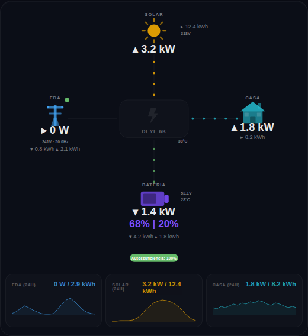

# ⚡ xPower Flow Card

A modern, lightweight power flow card for **solar hybrid inverters** in Home Assistant.

Built from scratch with animated dot-flow lines, smooth 24h sparkline charts, battery runtime estimation, and a dark glassmorphism aesthetic — all in a single ~34K.5B file with zero dependencies.



## Supported Inverters

| Brand | Integration | Polarity | Status |
|-------|-------------|----------|--------|
| **Deye** | Solarman / deye_inverter | bat: neg=charge, grid: pos=import | Tested |
| **Sunsynk** | Sunsynk / modbus | bat: neg=charge, grid: pos=import | Preset |
| **Huawei** | FusionSolar | bat: pos=charge, grid: pos=import | Preset |
| **Fronius** | Gen24 / Modbus | bat: pos=charge, grid: pos=import | Preset |
| **Growatt** | Growatt / modbus | bat: neg=charge, grid: pos=import | Preset |
| **Victron** | Venus OS / GX | bat: neg=charge, grid: pos=import | Preset |
| **SolarEdge** | Modbus / SunSpec | bat: pos=charge, grid: neg=import | Preset |
| **Any other** | Custom | Configurable | Custom preset |

Select your brand in the visual editor — entities and polarity are auto-configured.

## Features

- **8 inverter presets** — Deye, Sunsynk, Huawei, Fronius, Growatt, Victron, SolarEdge, Custom
- **Polarity normalization** — configurable battery and grid sign conventions
- **Animated dot flow** — speed proportional to power (more watts = faster dots)
- **Color-coded flows** — green for charging/exporting, red for importing, purple for discharging
- **Battery runtime** — estimated time to shutdown SOC with ETA clock
- **Battery gauge** — visual SOC level inside the battery icon
- **Battery temperature & voltage** — displayed alongside the battery icon
- **24h sparkline charts** — smooth Catmull-Rom area charts with auto-refresh every 5 minutes
- **Auto-scaling sparklines** — dynamic Y-axis based on actual data
- **Autarky pill** — color changes based on self-sufficiency (green/orange/red)
- **Daily totals** — import/export arrows with kWh values
- **Trend arrows** — ▴ rising, ▾ falling, ▸ stable
- **Grid status dot** — green/red/gray (when unconfigured)
- **Unavailable handling** — shows `--` when sensors are offline
- **Visual editor** — preset selector, polarity config, entity fields
- **Multi-language** — Portuguese (pt) and English (en)
- **Lightweight** — ~34KB single file, no build step, no dependencies

## Installation

### HACS (Recommended)

1. Open HACS → Frontend → **⋮** → Custom repositories
2. Add `https://github.com/BTNBx/xPower-Flow-Card` as **Dashboard**
3. Search for "xPower Flow Card" and install
4. Refresh your browser (Ctrl+Shift+R)

### Manual

1. Download `xpower-flow-card.js` from the [latest release](https://github.com/BTNBx/xPower-Flow-Card/releases)
2. Copy to `/config/www/xpower-flow-card.js`
3. Add resource in **Settings → Dashboards → ⋮ → Resources**:
   - URL: `/local/xpower-flow-card.js`
   - Type: JavaScript Module
4. Refresh your browser

## Configuration

### Visual Editor

Add the card via the UI and use the built-in visual editor. Select your inverter brand from the **Preset** dropdown — all entities and polarity settings are auto-filled.

### YAML (Deye example)

```yaml
type: custom:xpower-flow-card
preset: deye
language: pt
inverter_name: DEYE 6K
shutdown_soc: 20
battery_capacity: 5120
```

### YAML (Huawei example)

```yaml
type: custom:xpower-flow-card
preset: huawei
language: en
inverter_name: Huawei SUN2000
shutdown_soc: 10
battery_capacity: 10000
```

### YAML (Custom / any inverter)

```yaml
type: custom:xpower-flow-card
preset: custom
language: en
inverter_name: My Inverter
bat_polarity: negative   # negative = charging (Deye convention)
grid_polarity: positive  # positive = importing
shutdown_soc: 15
battery_capacity: 10240
solar: sensor.my_pv_power
battery: sensor.my_battery_power
soc: sensor.my_battery_soc
grid: sensor.my_grid_power
load: sensor.my_load_power
grid_voltage: sensor.my_grid_voltage
battery_voltage: sensor.my_battery_voltage
pv_voltage: sensor.my_pv_voltage
temperature: sensor.my_inverter_temp
frequency: sensor.my_grid_frequency
grid_status: binary_sensor.my_grid_connected
daily_solar: sensor.my_daily_production
daily_import: sensor.my_daily_import
daily_export: sensor.my_daily_export
daily_load: sensor.my_daily_consumption
daily_charge: sensor.my_daily_charge
daily_discharge: sensor.my_daily_discharge
battery_temperature: sensor.my_battery_temp
```

### Options

| Option | Default | Description |
|--------|---------|-------------|
| `preset` | `deye` | Inverter brand preset |
| `language` | `pt` | Card language (`pt` or `en`) |
| `inverter_name` | `DEYE` | Display name for the inverter |
| `bat_polarity` | `negative` | Battery: `negative` = charging (Deye) or `positive` = charging (Huawei) |
| `grid_polarity` | `positive` | Grid: `positive` = import (Deye) or `negative` = import (SolarEdge) |
| `shutdown_soc` | `20` | Battery shutdown SOC percentage |
| `battery_capacity` | `5120` | Battery capacity in Wh |

### Polarity Guide

Different inverters report battery and grid power with different sign conventions:

**Battery power:**
- `negative` = charging: Deye, Sunsynk, Growatt, Victron
- `positive` = charging: Huawei, Fronius, SolarEdge

**Grid power:**
- `positive` = importing: Deye, Sunsynk, Huawei, Fronius, Growatt, Victron
- `negative` = importing: SolarEdge

The card normalizes all values internally to: **positive = discharging/importing**, **negative = charging/exporting**.

## Changelog:

### v1.0.8

- Flow lines properly aligned with inverter icon edges
- Battery SOC and runtime text changed to white
- Reduced bottom spacing below autarky pill

### v1.0.7

- Flow lines realigned with inverter icon
- Inverter name is now optional — leave empty to hide
- Solar values changed to green, Battery values changed to yellow
- Sparkline colors updated to match new scheme

### v1.0.6

- Inverter icon redesigned — realistic device with display, LEDs, and status bars replacing the old plain box

### v1.0.5

- Colored power values — Solar (yellow), Grid (red), Home (cyan), Battery (purple)
- Labels and secondary info (voltage, kWh, temperature) remain neutral gray

### v1.0.4

- Grid status dot removed for cleaner look
- Label alignment improved (GRID/HOME closer to icons)
- Flow lines no longer overlap icons or text
- Autarky pill resized and repositioned
- Sparkline tooltips now show actual time (e.g. `330 W · 14:30`)
- Editor SOC field ID conflict fixed (`#ed-soc` → `#ed-ssoc`)

### v1.0.3

- Preset selector in visual editor with auto-fill
- Named constants replacing magic numbers
- Runtime flicker fix (50W minimum threshold)
- SVG class handling improved (`className.baseVal` → `setAttribute`)
- Empty entity guard in `_gv()`
- Sparkline auto-refresh every 5 minutes
- Battery gauge fix (was inverted)
- Unavailable sensors show `--` instead of `0 W`
- Editor memory leak fix (event delegation)
- HACS metadata corrected

### v1.0.2

- **Multi-inverter support** — 8 presets: Deye, Sunsynk, Huawei, Fronius, Growatt, Victron, SolarEdge, Custom
- **Polarity normalization** — configurable `bat_polarity` and `grid_polarity` with visual editor
- **Preset selector** — changing preset auto-fills all entity names and polarity
- **Named constants** — magic numbers replaced with `HIST_POINTS`, `RUNTIME_MIN_W`, `ANIM_MAX_W`, etc.
- **Runtime flicker fix** — 50W minimum threshold prevents display flicker near zero
- **className.baseVal → setAttribute** — more robust SVG class handling
- **Empty entity guard** — `_gv()` safely handles unconfigured entities
- **Grid dot gray** — shows gray when `grid_status` entity is not configured

### v1.0.1

- Sparkline auto-refresh every 5 minutes
- Auto-scaling Y-axis
- Battery gauge fix (was inverted)
- Unavailable/unknown → `--` display
- Editor memory leak fix (event delegation)
- Icon/text overlap fixes

### v1.0.0

- Initial public release

## Credits

Designed and built by [@BTNBx](https://github.com/BTNBx).

## License

MIT
