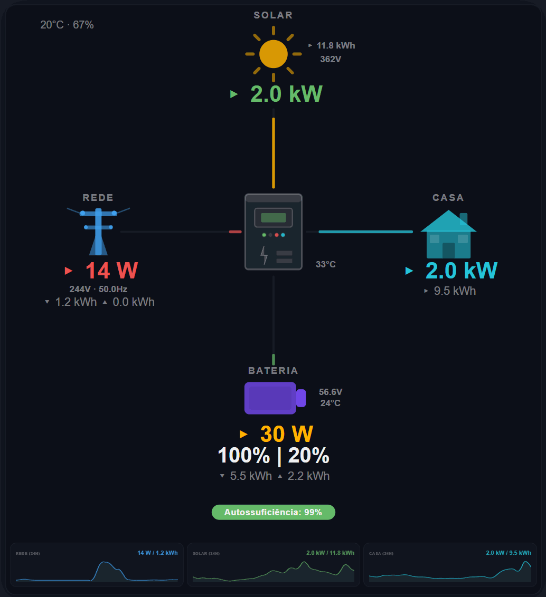

A power flow visualization card for solar hybrid inverters in Home Assistant. Single file, no dependencies.



## Supported Inverters

| Brand | Integration | Status |
|-------|-------------|--------|
| **Deye** | Solarman / deye_inverter | Tested |
| **Sunsynk** | Sunsynk / Modbus | Preset |
| **Huawei** | FusionSolar | Preset |
| **Fronius** | Gen24 / Modbus | Preset |
| **Growatt** | Growatt / Modbus | Preset |
| **Victron** | Venus OS / GX | Tested |
| **SolarEdge** | Modbus / SunSpec | Preset |
| **Solis** | SolisCloud / Modbus  | Preset / Tested |
| **Any other** | Custom | Custom preset |

Select your brand in the visual editor. Entities and polarity are configured automatically.

## Features
* 9 inverter presets with auto-configured entities and polarity
* 9 languages: Portuguese, English, German, French, Spanish, Italian, Dutch, Polish, Swedish
* Configurable battery and grid polarity sign conventions
* Dual MPPT support - configure two solar strings independently
* Optional EV charging node with animated flow, blinking bolt, SOC and daily energy
* Extra consumption nodes — appliances, garage, heat pump, and custom loads, each with its own power sensor, icon, and label
* Animated pulse flow lines with speed proportional to power output
* Inverter → home flow coloured by the mix feeding the home (solar green / battery amber / grid red)
* Color-coded values: solar (green), grid (red), home (cyan), battery (yellow)
* Inverter icon with 4 status LEDs indicating active energy flows
* Battery runtime estimation with shutdown SOC and ETA
* Optional weather display (temperature and humidity)
* 24-hour sparkline charts with Catmull-Rom interpolation, updated every 5 minutes
* Sparkline tooltips showing power and timestamp on hover
* Auto-scaling Y-axis on all sparklines
* Circular self-sufficiency ring — split by the source feeding the home (solar / battery / grid), centered %, leaf glyph, sliding slice transitions, and hover/tap label
* Daily totals for import, export, and production in kWh
* Trend arrows for rising, falling, or stable values
* Graceful handling of unavailable sensors (`--`)
* Dynamic card border color reflecting the dominant energy source
* Visual editor for all configuration options
* Adjustable main-value font size from the visual editor
* Light and dark theme support with automatic detection
* Compact mode (flow diagram only, no sparklines)
* Three-phase grid voltage display (L1/L2/L3)
* Split battery charge/discharge sensors for Solis/Modbus setups
* Daily energy cost overlay (import cost / export earnings)
* Optional energy price display driven by a tariff sensor (with price icons)
* Grid status indicator dot (on-grid / off-grid)
* Click any node to open its more-info dialog — dual-MPPT opens each string (PV1/PV2) separately
* Full theming via CSS custom properties (`--xpf-*`)
* Performance-optimized: entity diffing, paused updates in hidden tabs
* Animated value transitions, smooth count-up on power and self-sufficiency changes
* Gradient-filled sparkline areas
* EV SOC shown as a mini iOS-style pill (green while charging)
* Respects `prefers-reduced-motion` (all animations disabled)
* Fully translated visual editor (all 9 languages)
* One-click entity auto-detection (HA Energy Dashboard + power sensor heuristics)
* Live entity validation in the editor — missing entities flagged in red
* `prefers-color-scheme` theme fallback when HA theme info is absent

## Installation

### HACS (Recommended)

[](https://my.home-assistant.io/redirect/hacs_repository/?owner=BTNBx&repository=xPower-Flow-Card&category=dashboard)

1. Open **HACS** in Home Assistant
2. Search for **"xPower Flow Card"** and install
3. Refresh your browser (Ctrl+Shift+R)

### Manual

1. Download `xpower-flow-card.js` from the [latest release](https://github.com/BTNBx/xPower-Flow-Card/releases)
2. Copy to `/config/www/xpower-flow-card.js`
3. Add resource in **Settings > Dashboards > Resources**:
   - URL: `/local/xpower-flow-card.js`
   - Type: JavaScript Module
4. Refresh your browser

## Configuration

### Visual Editor

Add the card through the UI and use the built-in visual editor. Select your inverter brand from the **Preset** dropdown to auto-fill all entity and polarity fields.

### YAML (Deye example)

```yaml
type: custom:xpower-flow-card
preset: deye
language: pt
inverter_name: DEYE 6K
shutdown_soc: 20
battery_capacity: 5120
weather_temp: sensor.outdoor_temperature
weather_humidity: sensor.outdoor_humidity
```

### YAML (Dual MPPT example)

```yaml
type: custom:xpower-flow-card
preset: deye
solar: sensor.deye_pv1_power
solar2: sensor.deye_pv2_power
pv_voltage: sensor.deye_pv1_voltage
pv_voltage2: sensor.deye_pv2_voltage
```

### YAML (Huawei example)

```yaml
type: custom:xpower-flow-card
preset: huawei
language: de
inverter_name: Huawei SUN2000
shutdown_soc: 10
battery_capacity: 10000
```

### YAML (Custom / any inverter)

```yaml
type: custom:xpower-flow-card
preset: custom
language: en
inverter_name: My Inverter
bat_polarity: negative
grid_polarity: positive
shutdown_soc: 15
battery_capacity: 10240
solar: sensor.my_pv_power
solar2: sensor.my_pv2_power
battery: sensor.my_battery_power
soc: sensor.my_battery_soc
grid: sensor.my_grid_power
load: sensor.my_load_power
grid_voltage: sensor.my_grid_voltage
battery_voltage: sensor.my_battery_voltage
pv_voltage: sensor.my_pv_voltage
pv_voltage2: sensor.my_pv2_voltage
temperature: sensor.my_inverter_temp
frequency: sensor.my_grid_frequency
grid_status: binary_sensor.my_grid_connected
daily_solar: sensor.my_daily_production
daily_import: sensor.my_daily_import
daily_export: sensor.my_daily_export
daily_load: sensor.my_daily_consumption
daily_charge: sensor.my_daily_charge
daily_discharge: sensor.my_daily_discharge
battery_temperature: sensor.my_battery_temp
weather_temp: sensor.my_outdoor_temp
weather_humidity: sensor.my_outdoor_humidity
```

### Options

| Option | Default | Description |
|--------|---------|-------------|
| `preset` | `deye` | Inverter brand preset |
| `language` | `pt` | Card language (`pt`, `en`, `de`, `fr`, `es`, `it`, `nl`, `pl`, `sv`) |
| `inverter_name` | `DEYE` | Display name (leave empty to hide) |
| `bat_polarity` | `negative` | `negative` = charging (Deye) or `positive` = charging (Huawei) |
| `grid_polarity` | `positive` | `positive` = import (Deye) or `negative` = import (SolarEdge) |
| `shutdown_soc` | `20` | Battery shutdown SOC percentage |
| `battery_capacity` | `5120` | Battery capacity in Wh |
| `solar2` | | Second MPPT solar power sensor (optional) |
| `pv_voltage2` | | Second MPPT PV voltage sensor (optional) |
| `weather_temp` | | Temperature sensor for weather display |
| `weather_humidity` | | Humidity sensor for weather display |
| `price_sensor` | | Electricity price sensor — shows current price with the sensor's own unit (optional) |
| `extra{1,2,3}_power` | | Power sensor for each extra-consumer node (optional; node hidden when empty) |
| `extra{1,2,3}_name` | | Custom label for each extra-consumer node (falls back to the icon's name) |
| `extra{1,2,3}_icon` | `appliance` / `heatpump` / `garage` | Icon per node: `appliance`, `heatpump`, `garage`, `generic` |

## Extra consumption nodes & energy price

Set in YAML (not exposed in the visual editor yet).

### Extra consumption nodes
Up to three extra loads branch off the home node. Each appears only when its `*_power` entity is set.

| Option | Description |
| --- | --- |
| `extra1_power`, `extra2_power`, `extra3_power` | Power sensor for the extra load (required to show the node) |
| `extra1_name`, `extra2_name`, `extra3_name` | Optional label (falls back to the icon's default name) |
| `extra1_icon`, `extra2_icon`, `extra3_icon` | Icon type — `appliance`, `heatpump`, or `garage` (defaults: 1 = appliance, 2 = heatpump, 3 = garage) |

Shorthand aliases also work and map to the three slots: `appliance_power` → extra1, `heatpump_power` → extra2, `garage_power` → extra3 (each with a matching `*_name`).

### Energy price
| Option | Description |
| --- | --- |
| `price_sensor` | Sensor holding the current energy price; shown with a price icon |
| `import_cost`, `export_cost` | Import cost / export earnings rates for the daily cost overlay |

### Polarity Guide

**Battery power:**
- `negative` = charging: Deye, Sunsynk, Growatt
- `positive` = charging: Huawei, Fronius, SolarEdge, Victron, Solis

**Grid power:**
- `positive` = importing: Deye, Sunsynk, Huawei, Fronius, Growatt, Victron, Solis
- `negative` = importing: SolarEdge

### Inverter LEDs

The 3 LEDs on the inverter icon reflect active power flows:

| LED | Color | Condition |
|-----|-------|-----------|
| 1st | Green | Solar producing (>10 W) |
| 2nd | Orange | Battery discharging (>10 W) |
| 3rd | Red | Grid importing (>10 W) |

LEDs blink when active and remain dim when inactive.

## Changelog

## v1.3.27

- **Autarky ring, smoother transitions.** The coloured slices now glide
  when the mix changes instead of jumping, and the centre percentage counts
  up/down with the same easing as the power values. Both honour reduced
  motion.
- **Home flow bands — fixed order.** The inverter → home line now shows the
  source bands in a fixed order (solar, battery, grid) instead of ordering
  them by size.

## v1.3.26

- **Extra consumption nodes.** Appliances, garage, heat pump, and a spare
  "extra" node, each with its own power entity, icon, label, and flow to
  the home.
- **Energy price display** with per-source price icons.
- **Click-through more-info.** Tapping a node opens its Home Assistant
  more-info dialog.
- **Swedish (sv) translation** added.

_Thanks to @Cm0n89 for this contribution._

## v1.3.25

- **Self-sufficiency ring split by source.** The autarky mini-ring is now
  divided into coloured bands by what's feeding the home — green = solar,
  amber = battery, red = grid. The ring always fills to 100%; the centre
  number still shows self-sufficiency (solar + battery share).
- **Inverter → home flow line split by source.** The same colour bands are
  applied to the home flow line, ordered from the smallest share (at the
  inverter) to the largest (at the home end). Same line and pulse animation
  as before.

## v1.3.24
- Bug fixing

## v1.3.23
   - **Fix:** grid-export flow phase, resync compared 'fl' but the class is 'fL',
     so the -T/2 outlet delay never applied while exporting. Corrected to 'fL'.
   - **Solar node (single MPPT):** daily kWh and PV voltage enlarged to match the
     grid node (13px / 11px) and nudged right (x 314 -> 330) to clear the sun.

## v1.3.22

- **Solar day ring redesigned**, 96 thin radial ticks (r 32→40, amber→coral gradient) replace the continuous arc. Elapsed ticks light up as the day progresses; the rest stay dimmed. Progress path, position dot and halo removed.
- **Sun icon**, rays removed in favour of a radial-gradient disc (r=19) with a soft halo (r=28). The `sun-spin` rotation was dropped (invisible on a plain disc), along with its keyframes and the unused `.sr-halo`/`srPulse` rules.
- **Sunrise/sunset times**, hidden by default, revealed on hover or on tap of the ring (invisible hit path + `.srshow` class for 3s on touch). Tapping the ring no longer opens the solar more-info dialog.
- **Inverter icon redesigned**, near-square white body (38×38, rx 5), dark central capsule with three status LEDs (green solar, amber battery, red grid) and three connector tabs on the base. The skeuomorphic box, LCD readout, bolt, vents and the 4th (load) LED are gone.
- **Accent bar tied to grid status**, green when the grid is online, red when it is down, Huawei red when no `grid_status` entity is configured.
- **Flow lines re-anchored** to the new inverter body: equal 6px gap on all four sides (solar/battery moved in, grid/home moved out). The EV line is unchanged.

## v1.3.21

### Fixed
- 24h sparklines floated above the panel bottom when header text wrapped (narrow layouts equalize panel heights). Charts are now pinned to the bottom of each panel.

### Added
- **Solar day ring**: 270° arc around the sun icon showing sunrise → sunset progress, amber gradient, animated position dot (opacity pulse only), sunrise and sunset times at the arc ends. Uses `sun.sun` (configurable via `sun_entity`), hidden below the horizon. New editor field, translated in 8 languages.

### Changed
- PV1/PV2 side info restructured as centered columns (title / power / voltage) with amber inward arrows outside the values. Single-MPPT setups keep the daily kWh on the right.
- `SOLAR` label moved up (y −2 → −10); viewBox top extended (0 → −8) for dot clearance at solar noon.

## v1.3.20

- Bug fixing

## v1.3.19

**Visual**
- Main SVG viewBox height 487 -> 470: kills the dead band under the battery node (content ends ~463). Scales with width, so the phone gap shrinks proportionally. Compact mode unaffected, nothing sits below y=470. Also v1.4.7 gap fix used mm by mistake (4mm ~ 15px); now 4px.

## v1.3.18

**Animation**
- True pass-through relay: Home outlet delayed -T/2 so its pulse departs the inverter the instant the inlet pulse front arrives (was: departed only after inlet fully drained). Home -> EV keeps zero delay, which now chains exactly off the pulse arriving at Home.

**Fixes**
- Dual-color SOC numbers invisible on iOS (WebKit ignores clip-path on SVG <text>, layers cancel out). Replaced text clip-paths with nested <svg> viewport cropping battery + EV pill. Desktop unchanged.

## v1.3.17

**Visual**
- Power values vertically aligned to a consistent ~15px from each icon's visual edge (solar y=82->81, grid y=268->265) real geometry varies but perceived gap is now even
- Removed green pulse on the battery fill while charging (dimming made the number hard to read); solid green fill + bolt remain


**Features**
- New option `grid_threshold` (W, default 0): grid readings below it count as 0 value dims, flow stops, icon goes inactive, autarky unaffected by standby draw


**Fixes**
- Battery no longer shows green charging state at 100% SOC (residual standby draw kept it green)
- Battery node alignment: icon group now centers on the pill body (values below no longer look shifted right)  
- Battery power/daily/runtime rows moved up 8px gap to icon now matches the Home node
- Flows/LEDs frozen when the OS has "reduce motion" enabled v1.3.16 honored it unconditionally. Now gated by new config `animations`: 'auto' (default, follow OS) or 'always' (ignore OS). Applied via :host(.rm) class instead of a hard @media rule; tween respects the same setting.

## v1.3.16

**Features**
- Editor: one-click **entity auto-detection** reads the HA Energy Dashboard preferences (daily energy stats) and applies power-sensor heuristics; only fills empty fields
- Editor: **live entity validation** unknown entity ids get a red border and a warning
- Editor: field labels **translated in all 8 languages**
- EV SOC displayed as a **mini iOS pill** (matches the battery icon, green while charging)

**Visual**
- Smooth **count-up tween** on all main power values (600 ms, cubic ease-out)
- Sparkline areas now use **vertical gradient fills**

**Accessibility**
- `prefers-reduced-motion` honored: all animations off, values update instantly
- `prefers-color-scheme` fallback for theme auto-detection when HA theme info is absent


## v1.3.13, v1.3.14, v1.3.15

- **Bug fixing**

## v1.3.12

### Features
- **EV charging node** new node in the bottom-right corner, below Home: car icon, charge power, optional SOC and daily charged energy
- New optional entities: `ev_power`, `ev_soc`, `daily_ev` (visual editor + YAML) node is hidden when not configured
- Animated Home → EV flow (green) with blinking charge bolt while charging; click opens more-info

### Example
```yaml
ev_power: sensor.wallbox_power    # W
ev_soc: sensor.car_battery        # % (optional)
daily_ev: sensor.wallbox_today    # kWh (optional)
```
### Visual
- **Battery icon redesigned iPhone-style** SOC percentage now rendered inside the icon, over the fill level (white text with dark outline for legibility)
- Battery icon enlarged (scale 1.70 → 2.05); standalone SOC text row removed; daily/runtime rows moved up.

## v1.3.11

### Performance
- `hass` setter now diffs configured entity states, full DOM update is skipped when nothing relevant changed (previously ran on every state change of *any* HA entity)
- Updates and history polling pause while the tab is hidden (`visibilitychange`); instant refresh on return

### Fixed
- **Sparklines**: 24h history is now bucketed by timestamp into 48 uniform 30-min slots with forward-fill, fixes time-axis distortion and wrong tooltip times caused by `significant_changes_only` irregular sampling
- **Editor**: identical config echo from HA no longer re-renders the form, so input focus is preserved while editing
- **Autarky badge**: ≥90% glow now works via SVG filter (previous CSS `box-shadow` was dead code on SVG elements)
- Consistent null guards on battery level bar and flow line updates; `parseInt` with explicit radix in editor

### Added
- **Battery runtime**: while charging, shows estimated time to 100% with ETA (mirrors the existing discharge estimate)
- `getGridOptions()` for proper default sizing in HA sections view

### Internal
- Removed duplicated/corrupted v1.3.6 changelog block and dead CSS

## v1.3.10

### Fixed
- **Card crash with dual MPPT** - removed a dead code branch that referenced a variable before its declaration, throwing a `ReferenceError` and blanking the whole card when a second solar string was configured without PV voltage sensors.
- **Autarky badge language** - the badge label is now translated instead of being hard-coded in Portuguese.
- **Release pipeline** - the GitHub Action no longer fails on `npm ci` (no lockfile); the build now outputs to `dist/` instead of overwriting the source file, and the release uploads the minified `dist/` artifact.

### Changed
- Inverter name is now HTML-escaped before being rendered into the SVG.
- `hass-more-info` now dispatched as a proper `CustomEvent`.

## v1.3.9

- Bug fixing

## v1.3.8

### Fixed
- **Solar node text overlap** - PV1/PV2 power and PV voltage text no longer overlap the sun icon. Root cause: the `.vd` CSS class (`text-anchor:middle`) was overriding the SVG `text-anchor="start"` presentation attribute; now set via inline style.

### Added
- **Split battery sensors (Solis/Modbus)** - new optional `battery_charge` and `battery_discharge` entity fields for integrations that expose separate positive-only sensors. The card computes `discharge − charge` internally and ignores the polarity flag when these are set.
- **Three-phase grid voltage** - new optional `grid_voltage_l2` and `grid_voltage_l3` fields. When set, the grid node shows all three phases: `240/241/239V · 50.0Hz`.

## v1.3.7

**Fixes**

- Solis polarity - corrected for Modbus integrations. The preset now uses negative convention (same as Deye/Sunsynk), which means charging will show the correct direction without any manual override.
- Inverter LCD value - it was incorrectly showing the sum of all power flows, which made no sense. It now shows home consumption, matching the HOME node value.

**New**

- Victron dual MPPT - the Victron preset now includes solar2 and pv_voltage2 fields. When both MPPT sensors are configured, the Solar node displays a per-string breakdown: PV1: 180W  PV2: 151W, with the daily total on the line below.

**Visual**

- Font sizes increased - the smaller sub-labels (voltage, frequency, daily kWh) bumped from 9.5px/12px to 11px/13px.

## v1.3.6

**Visual**
- Autarky badge moved to top-right corner, aligned with weather widget top edge and right margin
- Badge color reworked — deep teal green background `#0d2b22` / border+bar `#1a4a36`; status threshold colors (≥50/25%) toned down with low-alpha rgba

**Animation**
- Inlet flows (solar/grid/battery → inverter) run at 75% of base speed — faster
- Outlet flow (inverter → home) runs at base speed — slower
- Visual effect of energy accumulating at the inverter before flowing out to home

**CSS Custom Properties**
- `--xpf-flow-width` — flow line stroke width (default: `3`)
- `--xpf-dash-size` — dash segment size (default: `100`; low value e.g. `8` = dot effect)

### v1.3.5
**Visual**

- Autarky badge moved to top-right corner
- Badge size reduced 15% (55×40 → 47×34)
- Badge green softened — border/fill use low-alpha rgba instead of solid #66BB6A; status threshold colors (≥80/50/25%) also toned down
- Added 8mm spacing between battery data and sparklines row

**Animation**

- Inlet flows (solar/grid/battery → inverter) run at 75% of base speed — faster
- Outlet flow (inverter → home) runs at base speed — slower
- Visual effect of energy accumulating at the inverter before flowing out to home

**CSS Custom Properties**

- --xpf-flow-width — flow line stroke width (default: 3)
- --xpf-dash-size — dash segment size (default: 100; low value e.g. 8 = dot effect)

### v1.3.4
- **Autarky badge** - vertically aligned with battery runtime text

### v1.3.3
- **Layout** - removed empty space between main card and sparkline charts

### v1.3.2
- **Autarky badge** - removed glow effect at 100% autarky
- **Layout** - reduced spacing between card and sparkline charts

### v1.3.1
- **2nd Bug fixing**

### v1.3.0
- **Bug fixing**

### v1.2.9
- **Autarky badge** - more compact dimensions (44×56), smaller font to keep number inside bounds, right-aligned to match weather widget margin

## v1.2.8
- **Bug fixing**

## v1.2.7

- **Bug fixing**

### v1.2.6

**Fixed**
- **Grid Voltage** now displays independently of Grid Frequency — each field renders on its own when only one is configured
- **Victron polarity** preset corrected to `positive` (Venus OS / SmartShunt reports discharge as positive, charge as negative); update your card if you were using the Huawei preset as a workaround
- **Solis** battery polarity no longer reverses regardless of selection — dedicated Solis preset added with correct polarity (`positive`)

**Added**
- **Dual MPPT support** — new `Solar Power (MPPT2)` and `PV Voltage (MPPT2)` entity fields; when both are set, total solar power is the sum of both strings and voltages display as e.g. `48V / 52V`
- **Solis preset** — dedicated preset for Solis (SolisCloud) inverters with correct default entities and polarity
- **Autarky badge** — replaced the flat pill with a bold badge showing the percentage in large type and a colour-coded band; positioned bottom-right of the card

### v1.2.5

**New Features**

- Entity click to open more-info dialog on all power nodes (solar, grid, load, battery)
- Battery sparkline with 24-hour history, tooltip, and charge/discharge daily summary
- Touch support for sparkline tooltips on mobile and tablet devices
- Energy cost overlay with configurable import cost and export earnings sensors
- Compact mode to hide sparklines for sidebar and popup use
- 15 CSS custom properties (--xpf-*) for theme and style customization

**Performance**

- requestAnimationFrame throttle on hass updates to reduce unnecessary redraws
- History loading and timer disabled in compact mode to eliminate redundant API calls

**Build**

- Added esbuild build pipeline with minification
- Added GitHub Actions workflow for automated releases on tag push
- Updated hacs.json with minimum Home Assistant version requirement
- Added package.json with build and watch scripts

**CSS Custom Properties**

- --xpf-bg, --xpf-radius, --xpf-shadow, --xpf-padding
- --xpf-solar, --xpf-battery, --xpf-grid, --xpf-load
- --xpf-green, --xpf-red, --xpf-orange
- --xpf-text, --xpf-text-secondary, --xpf-font-size
- --xpf-sparkline-bg, --xpf-sparkline-radius

**Configuration**

- New options: compact, import_cost, export_cost
- Layout selector in visual editor (Full / Compact)
- Import Cost and Export Earnings entity fields in visual editor

### v1.2.4

**Bug fixes**
- Grid status dot restored — green (online) / red (offline) indicator next to the grid label, reads from `grid_status` entity.
- Fixed copyright header to match MIT license.
- Tooltip time calculation corrected (was rounding to minutes, now uses fractional hours for accurate timestamps).
- History loading guard: `_loadHistory` now checks `this._h` exists before proceeding.

**Visual improvements**
- Smooth icon fade transitions (0.8 s) when power goes on/off — icons and values no longer snap instantly to dim/bright.
- Flow snake lines fade in/out smoothly instead of appearing/disappearing instantly.
- All flow animations synchronized — single shared speed based on the highest active power, all lines pulse in phase.
- Removed animation delay staggering for cleaner coordinated flow.

**Performance**
- Sparkline max values cached on history load — tooltips no longer recalculate `Math.max(...data)` on every mousemove.
- `downsample` extracted to class method — no longer recreated as a closure on every history refresh.

### v1.2.3

- Inverter LCD font size reduced to 6.5 px with tighter letter-spacing to fit within display bounds.

### v1.2.2

- Card border color now reflects the dominant energy source: green (solar), amber (battery), red (grid). Transitions over 1.5 s.
- LCD display redesigned: white text, unified green fill, no lightning icon or blink animation.
- Aurora effect removed; autarky pill golden glow at 90%+ retained.

### v1.2.1

- Ambient glow on card border based on dominant energy source.
- Inverter LCD display added showing total power throughput.
- Aurora gradient background above 90% autarky.
- Flow line color and opacity cross-fade over 800 ms.

### v1.2.0

- Bug fixes.

### v1.1.9

- Sun icon rotates while solar power exceeds 10 W; dims to 25% opacity when inactive.
- Solar, grid, home, and battery icons dim to 25% opacity when power is below 10 W.
- Battery fill turns green with pulse animation while charging above 10 W.

### v1.1.8

- Inverter bolt breathing glow animation.
- Battery charging animation.
- Sun rotation speed set to 20 s.
- Inverter-to-home flow uses yellow when battery is dominant source.
- Sparkline height increased to 55 px.

### v1.1.7

- Weather widget border and divider repositioned.
- Battery discharge flow color changed to yellow.

### v1.1.6

- Flow animations sequenced: incoming completes before outgoing starts.
- Weather widget border widened.

### v1.1.5

- Solar-to-inverter flow changed to green.
- Inverter-to-home flow color dynamic based on dominant source.
- Flow speed increases at 1000 W, 2000 W, 3000 W thresholds.

### v1.1.4

- Minor bug fixes.

### v1.1.3

- Grid tower icon changed to dark red.
- Light theme support with automatic detection.
- Adaptive history sampling for datasets exceeding 10,000 points.

### v1.1.2

- Flow animation stutter fix: speed updates only on changes exceeding 10%.

### v1.1.1

- Minor update.

### v1.1.0

- Zero-value sensors display correctly.
- XSS protection in editor via input sanitization.
- History request deduplication.
- Flow animation refined.
- Weather display added.
- 8 languages added.
- MIT license.

### v1.0.9

- Flow animation changed from dots to pulse/snake style.
- Inverter icon redesigned with 4 dynamic LEDs.
- Color-coded power values introduced.

### v1.0.2

- Initial public release.

## Credits

Designed and built by [@BTNBx](https://github.com/BTNBx).

## License

Licensed under MIT. See [LICENSE](LICENSE) for details.
